Teste Técnico Supabase - Caio César Moreira de Souza

1. Criação de tabelas para gerenciar clientes, produtos e pedidos.

Notei que era necessária uma quarta tabela, pedido_itens, para criar a relação N-para-N entre pedidos e produtos.

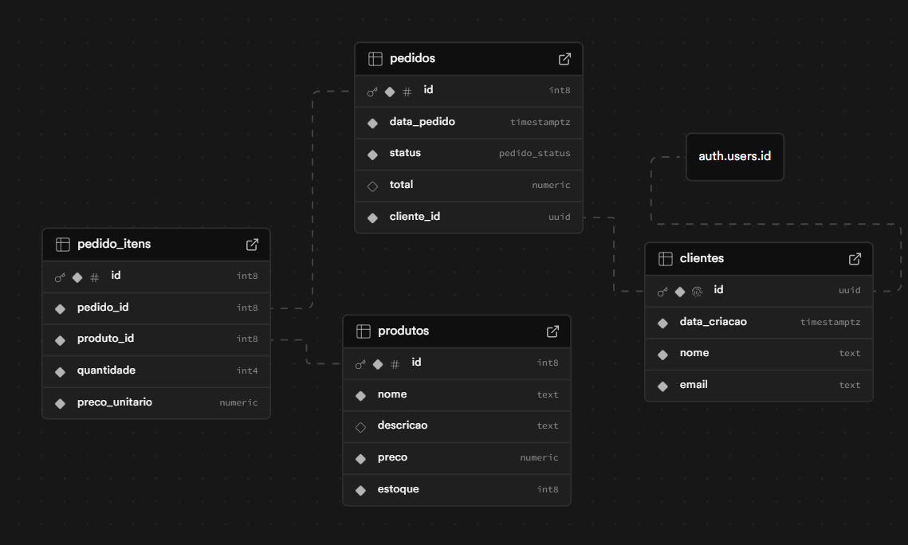

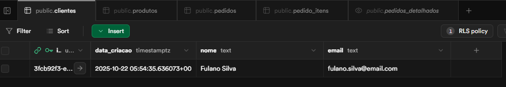

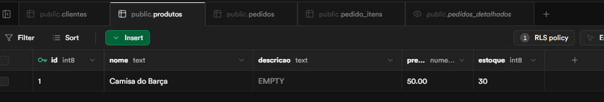

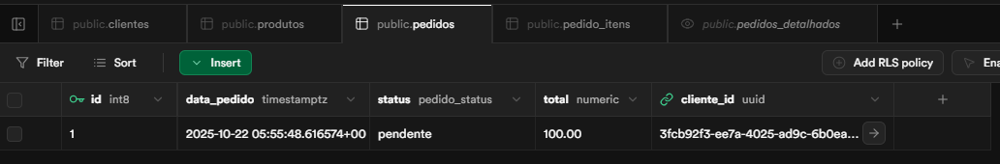

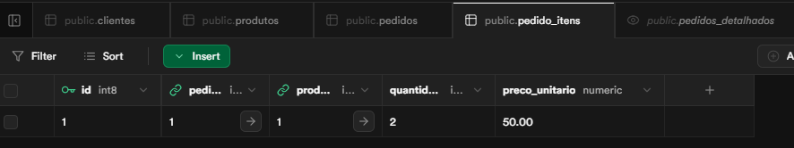

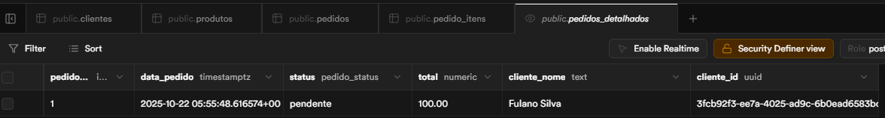

2. Implementação de Row-Level Security (RLS) para garantir que os dados sejam
acessados de forma segura.

Os produtos são públicos. As tabelas clientes e pedidos só podem ser acessadas pelo próprio usuário logado, usando a regra auth.uid() = cliente_id.

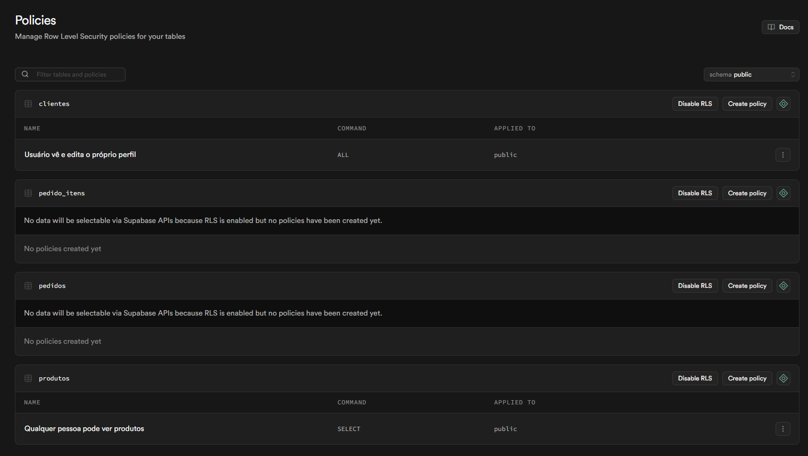

3. Criação de funções no banco de dados para automatizar processos, como cálculo de
total de pedidos e atualização de status.

Criei a função recalcular_total_pedido que roda em um Trigger. Toda vez que um item é adicionado/removido de pedido_itens, o total na tabela pedidos é atualizado automaticamente. Isso garante a consistência dos dados.

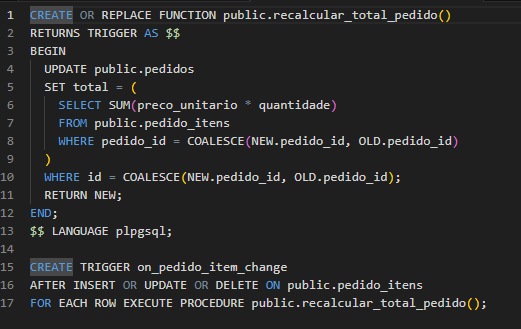

Também criei a função para atualizar status do pedido.

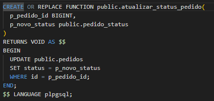
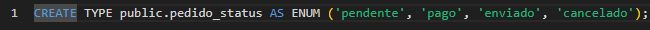

4. Criação de views para consultar dados de forma eficiente.

Criei a view pedidos_detalhados para otimizar as consultas, fazendo um JOIN entre pedidos e clientes de forma pré-calculada.

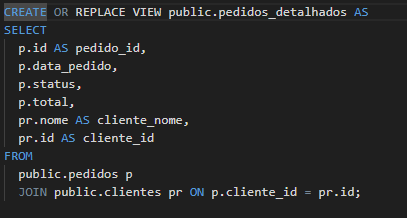

5. Criação de Edge Functions para automação de tarefas como envio de e-mails de
confirmação e exportar um csv do pedido de um cliente.

email-confirmacao: Esta função recebe um pedido_id e simula o envio de um e-mail (imprimindo no log). Ela usa a service_role key para poder buscar os dados do pedido.
exportar-csv: Esta função é segura e só funciona para usuários logados. Ela busca os pedidos do usuário (da view pedidos_detalhados), converte-os para o formato CSV e os retorna como um arquivo de texto.

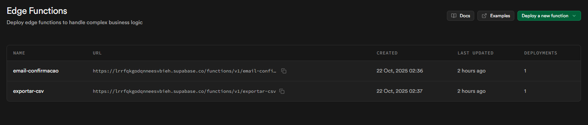
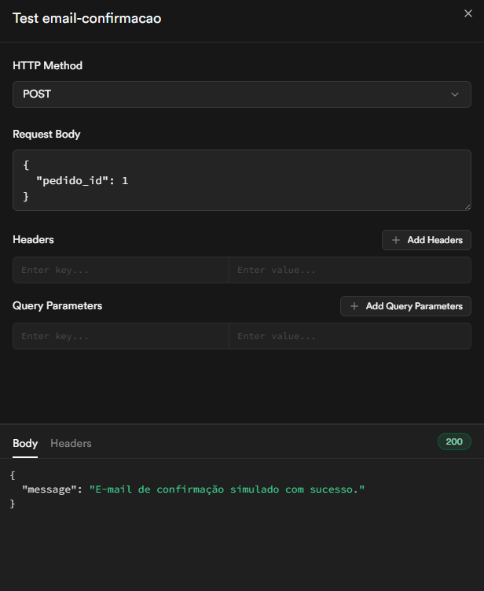
